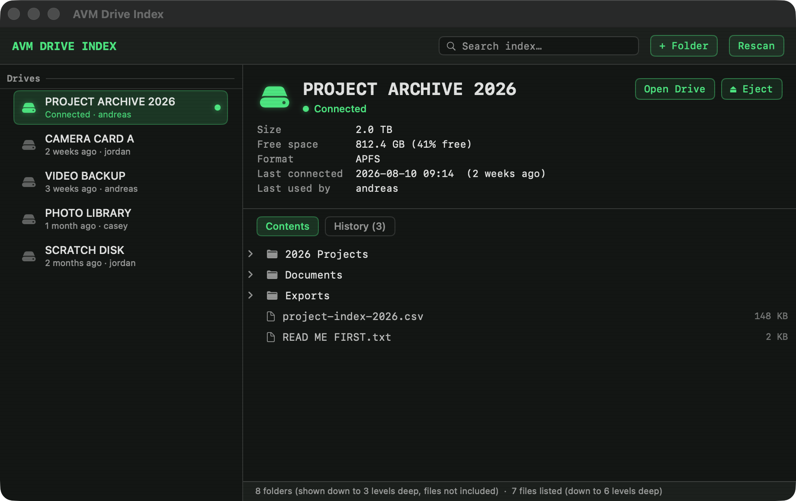
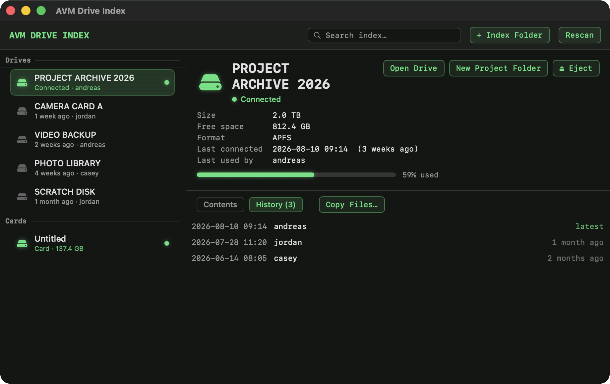
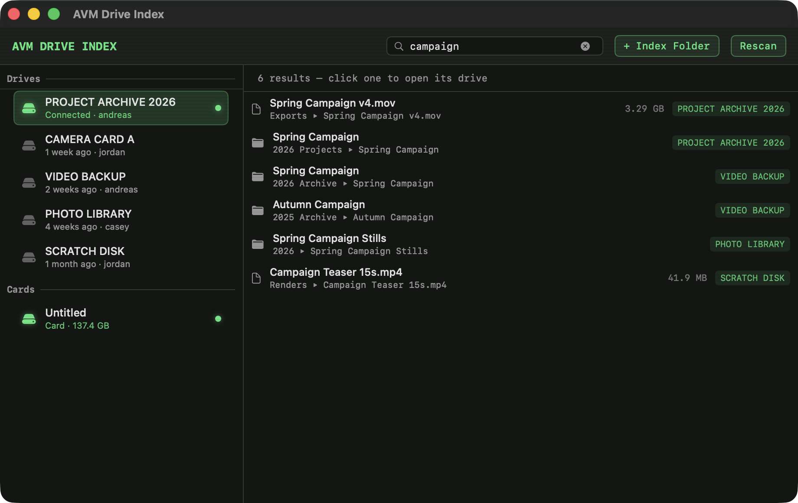
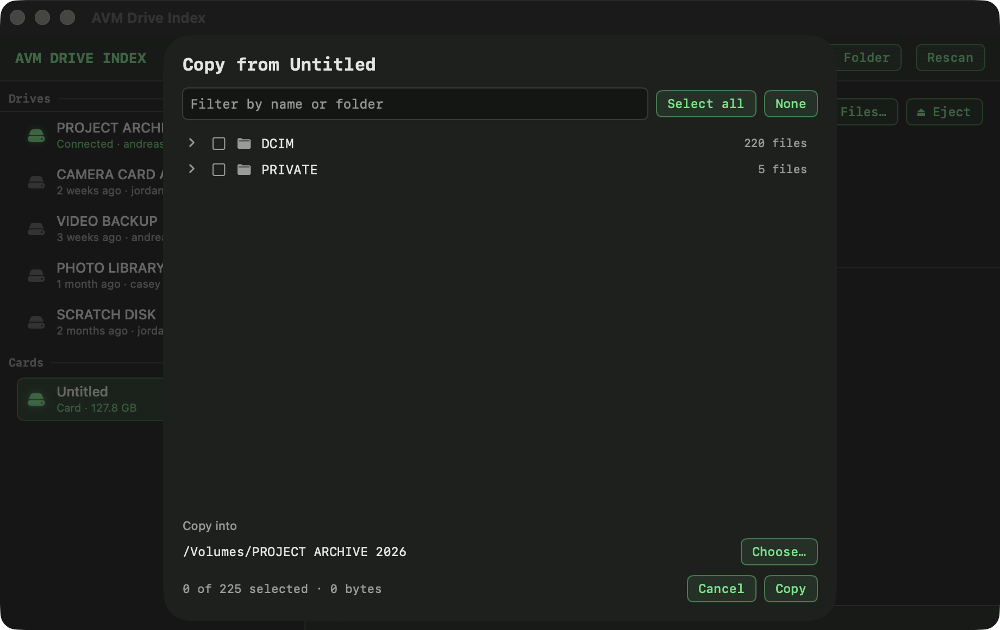
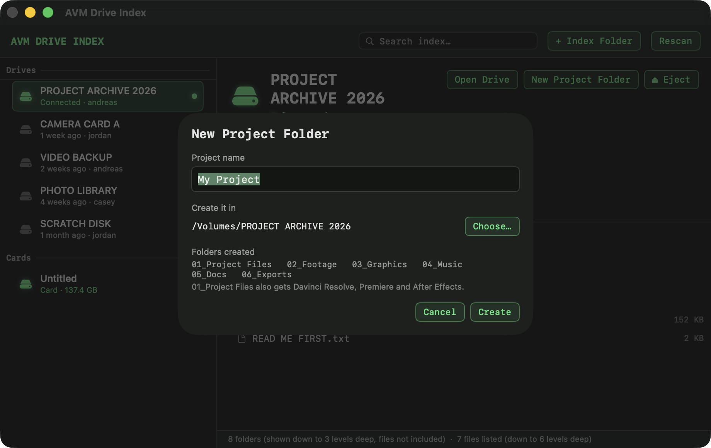

# AVM Drive Index

**Know what's on every external drive you own — without plugging any of them in.**

Connect a drive once and it's catalogued forever: every folder, every file,
how big it is, when the drive was last connected, and which user account was
signed in at the time. Unplug it and the catalogue stays. Available for
**macOS** and **Windows**.



## Why

External drives multiply. Camera cards, backup disks, archive drives, the
one in the drawer with no label. Six months later nobody remembers which one
has the file on it, so you plug in five drives to find out.

This keeps a searchable index of all of them, so you don't have to.

## What it does

- **Catalogues every external drive** you connect — automatically, in the
  background, whether or not the app is open.
- **Remembers folders *and* files**, with sizes, so you can browse a drive
  that's sitting in a drawer on the other side of the building.
- **Shows how much room is left** — free space alongside total size, plus a
  bar showing how full the drive is (amber past 90%), so you know which drive
  to reach for before you unplug anything.
- **Offloads memory cards** — insert a card, pick the files you want, and copy
  them into a folder on another drive without overwriting anything.
- **Starts new projects for you** — one button creates a consistent folder
  layout on the drive, so every job is filed the same way.
- **Records who used it last** — the user account signed in each time the
  drive was connected, with a full connection history.
- **Searches everything at once** — drive names, folder names and file names
  across every drive ever connected.
- **Groups and reorders drives** into folders so the list matches how you
  actually think about your drives.
- **Stays out of the way** — no account, no sync, no telemetry. Nothing ever
  leaves your computer. It uses essentially no resources while idle.

| Every connection, and who made it | Search across every drive at once |
|---|---|
|  |  |

## Copying off a card

Insert a memory card and it appears under **Cards** in the sidebar. Cards are
never catalogued — they get reformatted far too often to be worth a permanent
record — they are simply there while plugged in, with their contents read
fresh.



**Copy Files…** sits at the top for a card, and in the right-click menu for an
ordinary drive (copying off a drive is the rarer job).

You browse the card as a folder tree: open a folder to tick individual files,
or tick the folder itself to take everything in it. What you tick decides where
things land — **a file ticked on its own goes straight into the folder you
chose, and a folder you tick is recreated at the destination with its contents
inside**. So ticking `100MSDCF` puts a `100MSDCF` folder in your project, while
ticking three clips inside it drops just those three clips in.

It is deliberately careful with footage:

- nothing is ever removed from the card,
- a file already at the destination is skipped and listed, never overwritten,
- every copy's size is checked, and a short copy is deleted rather than left
  sitting there looking valid.

Files land directly in the folder you choose, so pointing it at a project's
`02_Footage` puts them straight where they belong.

## New Project

With a drive connected, **New Project** creates a consistent folder layout on
it — no more building the same tree by hand for every job:

```
<Project name>/
  01_Project Files/
    01_Davinci Resolve/
    02_Premiere/
    03_After Effects/
  02_Footage/
  03_Graphics/
  04_Music/
  05_Docs/
  06_Exports/
```



Name it, choose where it goes (the drive's top level by default), and the
folders appear. A folder that already exists is never merged into or
overwritten; you're told the name is taken instead.

## Download

| | Download | Requires |
|---|---|---|
| **macOS** | [AVM-Drive-Index-Mac.dmg](downloads/AVM-Drive-Index-Mac.dmg) | macOS 14 or later · Apple Silicon & Intel |
| **Windows** | [AVM-Drive-Index-Windows.zip](downloads/AVM-Drive-Index-Windows.zip) | Windows 10 or 11 |

Both are small (about 1 MB) and self-contained. Nothing else to install.

---

## Install on macOS

1. Open the downloaded **`.dmg`**.
2. Drag **AVM Drive Index** onto the **Applications** shortcut.
3. Open it from your Applications folder.
4. The first time, click **Turn On** in the yellow bar at the bottom. That
   starts the background helper that records drives as you connect them.

### Getting past the security warning

This app isn't signed with a paid Apple Developer certificate, so macOS
stops it the first time. This is expected for any app shared directly rather
than through the App Store. You only need to do this **once**.

**On macOS 15 (Sequoia) and later — including macOS 26:**

1. Try to open the app. macOS refuses and says it can't verify the developer.
2. Open **System Settings → Privacy & Security**.
3. Scroll down. There's a line about *"AVM Drive Index" was blocked* with an
   **Open Anyway** button. Click it.
4. Confirm with your password or Touch ID, then open the app again.

**On macOS 14 (Sonoma) and earlier:** right-click (or Control-click) the app
in Applications → **Open** → **Open**.

**If macOS says the app is "damaged and can't be opened"** — that's the
quarantine flag macOS puts on downloaded files, not actual damage. Open
**Terminal** and paste this, then press Return:

```
xattr -dr com.apple.quarantine "/Applications/AVM Drive Index.app"
```

Then open the app normally.

### One more prompt

macOS may ask whether the app can **access files on a removable volume**.
Click **Allow** — it reads folder and file *names* so it can catalogue them.
It never reads file contents, and nothing is sent anywhere.

If a drive's folders and files come up empty, that permission is the reason.
Open the app with the drive connected, press **Rescan**, and approve the
prompt — or switch on **AVM Drive Index** under System Settings → Privacy &
Security → Files and Folders. A drive's size, free space and history are
recorded either way; only the folder and file listing needs the permission.

---

## Install on Windows

1. **Before extracting**, right-click the downloaded **`.zip`** →
   **Properties** → tick **Unblock** → **OK**. This saves you several
   warnings later.
2. Extract the zip and put the **AVM Drive Index (Windows)** folder wherever
   you like — Desktop or Documents is fine.
3. Double-click **`Install Drive Indexer.cmd`**. It turns on the background
   helper and indexes whatever is already plugged in, then waits for a key
   press.
4. Double-click **`AVM Drive Index.cmd`** to open the app.

Optional: **`Create Desktop Shortcut.cmd`** puts a normal app icon on your
Desktop so you can open it like any other program.

### Getting past the security warning

If you skipped the **Unblock** step, Windows may show a blue
**"Windows protected your PC"** box. Click **More info**, then
**Run anyway**. Again, only needed once.

Your antivirus may also take an interest, because the installer registers a
scheduled task. That's exactly what it's for — starting the background
watcher when you sign in — and all the code is plain text you can read in
the `App` folder.

**On a managed or work PC**, script execution is sometimes disabled by
company policy. The launchers already ask Windows to permit only these files,
but if policy forbids even that, an IT administrator has to allow it.

---

## Where your catalogue lives

Nothing is hidden inside the app — it's plain folders and text files:

- **macOS** — `~/Library/Application Support/AVM Drive Index`
- **Windows** — `C:\Users\<you>\AppData\Local\AVM Drive Index`

Inside, each drive gets a folder containing `_DRIVE INFO.txt` (size, free
space, format, last connected, last used by, full history), `_FILE LIST.txt`
(every file with its size), and a mirror of the drive's folder structure as
real, browsable empty folders. There's also a `Drives Overview.txt` summary
with a free-space column.

## What gets indexed, and what doesn't

- **Included:** USB sticks, portable hard drives and SSDs — anything that
  looks like real external storage.
- **Ignored on purpose:** SD and other memory cards, mounted disk images
  (`.dmg`, `.iso`, `.vhd`), optical drives, and network drives.
- **Limits per drive:** folders mirrored 3 levels deep (up to 1,000), file
  names recorded 6 levels deep (up to 20,000). When a drive has more, the app
  says so rather than pretending it indexed everything.

## Free space — a snapshot, not a live reading

A drive's free space can only be measured while it's plugged in, so what you
see for an unplugged drive — the figure and the usage bar alike — is the
reading from its last connection, labelled *"at last connection"*. Reconnect
the drive and it updates itself.

## "Last used by" — what it can and can't see

Each connection records the user account signed in **on that computer** at
that moment. If someone takes a drive home and uses it on their own machine,
that won't show up. If several people share one computer under separate
accounts, run the installer once for each of them.

## Turning it off

- **macOS** — run `Uninstall Drive Indexer.command` from the source folder,
  or just delete the app. Your catalogue is left alone.
- **Windows** — double-click `Uninstall Drive Indexer.cmd`. Your catalogue is
  left alone; only future updates stop.

Removing a drive from the index (right-click → Remove from Index) moves that
drive's folder to the Trash / Recycle Bin, so it's recoverable.

## Building from source

Everything is in [`source/`](source) — the Mac app in Swift/SwiftUI, the
Windows app in PowerShell/WPF.

- **macOS:** double-click `source/mac/Build App.command`. Needs Apple's free
  Command Line Tools (`xcode-select --install`), not the full Xcode.
- **Windows:** nothing to build. The `.ps1` files *are* the app, running on
  the PowerShell that ships with Windows.

## Privacy

No accounts, no network calls, no analytics, no third-party code. The
catalogue never leaves the machine that made it. The app reads the *names*
of folders and files on your drives — never their contents.
